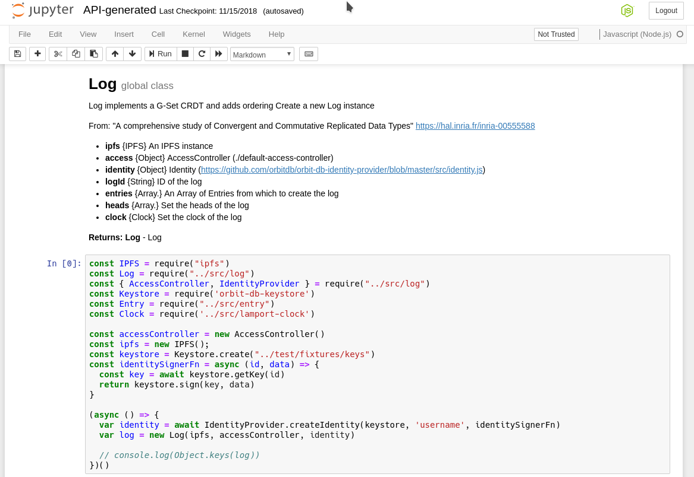

# hypatia 

> Converting JavaScript doctrings to ijavascript Jupyter Notebooks

## Background

Having interactive documentation in the form of Jupyter notebooks is awesome.
So is having accurate and up to date code-level documentation in the form of comments.
Wouldn't it be cool if you had a tool that transliterated the latter into the former,
giving you fully interactive Jupyter notebook versions of your docstring comments?

In other words, Hypatia turns this:

```
/**
 * @description
 * Log implements a G-Set CRDT and adds ordering
 * Create a new Log instance
 *
 * From:
 * "A comprehensive study of Convergent and Commutative Replicated Data Types"
 * https://hal.inria.fr/inria-00555588
 *
 * @constructor
 *
 * @example
 * const IPFS = require("ipfs")
 * const Log = require("../src/log")
 * const { AccessController, IdentityProvider } = require("../src/log")
 * const Keystore = require('orbit-db-keystore')
 * const Entry = require("../src/entry")
 * const Clock = require('../src/lamport-clock')
 *
 * const accessController = new AccessController()
 * const ipfs = new IPFS();
 * const keystore = Keystore.create("../test/fixtures/keys")
 * const identitySignerFn = async (id, data) => {
 *   const key = await keystore.getKey(id)
 *   return keystore.sign(key, data)
 * }
 *
 * (async () => {
 *   var identity = await IdentityProvider.createIdentity(keystore, 'username', identitySignerFn)
 *   var log = new Log(ipfs, accessController, identity)
 *
 *   // console.log(Object.keys(log))
 * })()
 *
 *
 * @param  {IPFS}           [ipfs]          An IPFS instance
 * @param  {Object}         [access]        AccessController (./default-access-controller)
 * @param  {Object}         [identity]      Identity (https://github.com/orbitdb/orbit-db-identity-provider/blob/master/src/identity.js)
 * @param  {String}         [logId]         ID of the log
 * @param  {Array<Entry>}   [entries]       An Array of Entries from which to create the log
 * @param  {Array<Entry>}   [heads]         Set the heads of the log
 * @param  {Clock}          [clock]         Set the clock of the log
 * @return {Log}                            Log
 */
```

into this:



Hypatia is built with native ReasonML and was created to manage the documentation in the [`orbitdb`](https://github.com/orbitdb) repositories.


## Installation

### Prerequisites: [`esy`](https://github.com/esy/esy) and [`pesy`](https://github.com/jordwalke/pesy)

Hypatia currently requires the `esy` and `pesy` tools to build and run.

```
npm install -g esy pesy
```

### Installation Steps

```
npm install -g hypatia
```

Then, the binary will be available at `hypatia.exe`. Move it where you want!

## Usage
First, create the jsdoc AST file.
```
jsdoc -X ./path/to/js/**/**.js > jsdoc-ast.json
```

Then, use `hypatia.exe` to generate the ipynb

```
$ hypatia.exe

Hypatia - jsdoc to ijavascript
Usage: hypatia.exe [input_file] [output_file]
 - input_file: jsondoc output .json file
 - output_file: jupyter notebook .ipynb file

$ hypatia.exe jsdoc-ast.json API.ipynb
```

## Contributing

Feel free to ask questions via GitHub issues. PRs are welcome.

To build the executable locally, follow these steps:

```
git clone https://github.com/aphelionz/hypatia.git
esy install
esy pesy
esy build
```

You can then run the example via `npm run example` or the executable via `esy x hypatia.exe`.

Then, if you would like, use `esy release` to build the npm package.

## License

[MIT](LICENSE) © 2018 Mark Henderson
